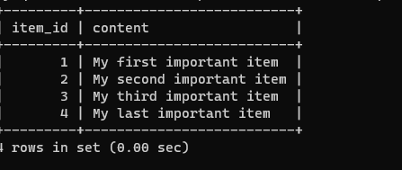

# Documentation of Project 2 

`sudo apt update`
`sudo apt install nginx`
`sudo systemctl status nginx`

`http://18.212.19.193:80`

`sudo apt install mysql-server`
`sudo mysql`

`sudo apt install php-fpm php-mysql`
`sudo mkdir /var/www/projectLEMP`
`sudo chown -R $USER:$USER /var/www/projectLEMP`
`sudo nano /etc/nginx/sites-available/projectLEMP`
`sudo ln -s /etc/nginx/sites-available/projectLEMP /etc/nginx/sites-enabled/`
`sudo nginx -t`

`sudo systemctl reload nginx`
`sudo echo 'Hello LEMP from hostname' $(curl -s http://169.254.169.254/latest/meta-data/public-hostname) 'with public IP' $(curl -s http://169.254.169.254/latest/meta-data/public-ipv4) > /var/www/projectLEMP/index.html`

`http://54.162.76.18:80`

`sudo nano /var/www/projectLEMP/info.php`
`http://54.162.76.18/info.php`

`sudo mysql
` CREATE DATABASE `example_database`;`
`CREATE USER 'example_user'@'%' IDENTIFIED WITH mysql_native_password BY 'password';`
`GRANT ALL ON example_database.* TO 'example_user'@'%';`

`mysql -u example_user -p`
`mysql>SHOW DATABASES;`

`mysql>INSERT INTO example_database.todo_list (content) VALUES ("My first important item");`
`mysql>  SELECT * FROM example_database.todo_list;`

`mysql> INSERT INTO example_database.todo_list (content) VALUES ("My first important item");`
`mysql>  SELECT * FROM example_database.todo_list;`

`nano /var/www/projectLEMP/todo_list.php`
`<?php
$user = "example_user";
$password = "password";
$database = "example_database";
$table = "todo_list";

try {
  $db = new PDO("mysql:host=localhost;dbname=$database", $user, $password);
  echo "<h2>TODO</h2><ol>";
  foreach($db->query("SELECT content FROM $table") as $row) {
    echo "<li>" . $row['content'] . "</li>";
  }
  echo "</ol>";
} catch (PDOException $e) {
    print "Error!: " . $e->getMessage() . " ";
    die();
}`

`http://54.92.223.12>/todo_list.php`
`

