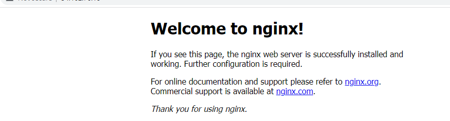
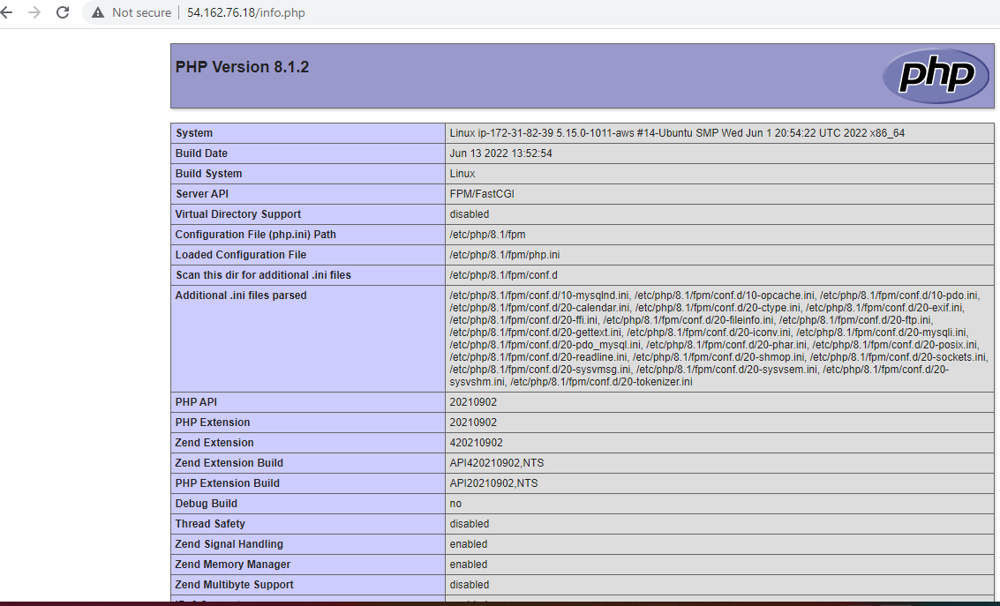

# Documentation of Project 2 

`sudo apt update`
`sudo apt install nginx`
`sudo systemctl status nginx`

`http://18.212.19.193:80`

`sudo apt install mysql-server`
`sudo mysql`

`sudo apt install php-fpm php-mysql`
`sudo mkdir /var/www/projectLEMP`
`sudo chown -R $USER:$USER /var/www/projectLEMP`
`sudo nano /etc/nginx/sites-available/projectLEMP`
`sudo ln -s /etc/nginx/sites-available/projectLEMP /etc/nginx/sites-enabled/`
`sudo nginx -t`

`sudo systemctl reload nginx`
`sudo echo 'Hello LEMP from hostname' $(curl -s http://54.162.76.18/latest/meta-data/public-hostname) 'with public IP' $(curl -s http://54.162.76.18/latest/meta-data/public-ipv4) > /var/www/projectLEMP/index.html`

`http://54.162.76.18:80`

`sudo nano /var/www/projectLEMP/info.php`
`http://54.162.76.18/info.php`

`sudo mysql
` CREATE DATABASE `example_database`;`
`CREATE USER 'example_user'@'%' IDENTIFIED WITH mysql_native_password BY 'password';`
`GRANT ALL ON example_database.* TO 'example_user'@'%';`

`mysql -u example_user -p`
`mysql>SHOW DATABASES;`

